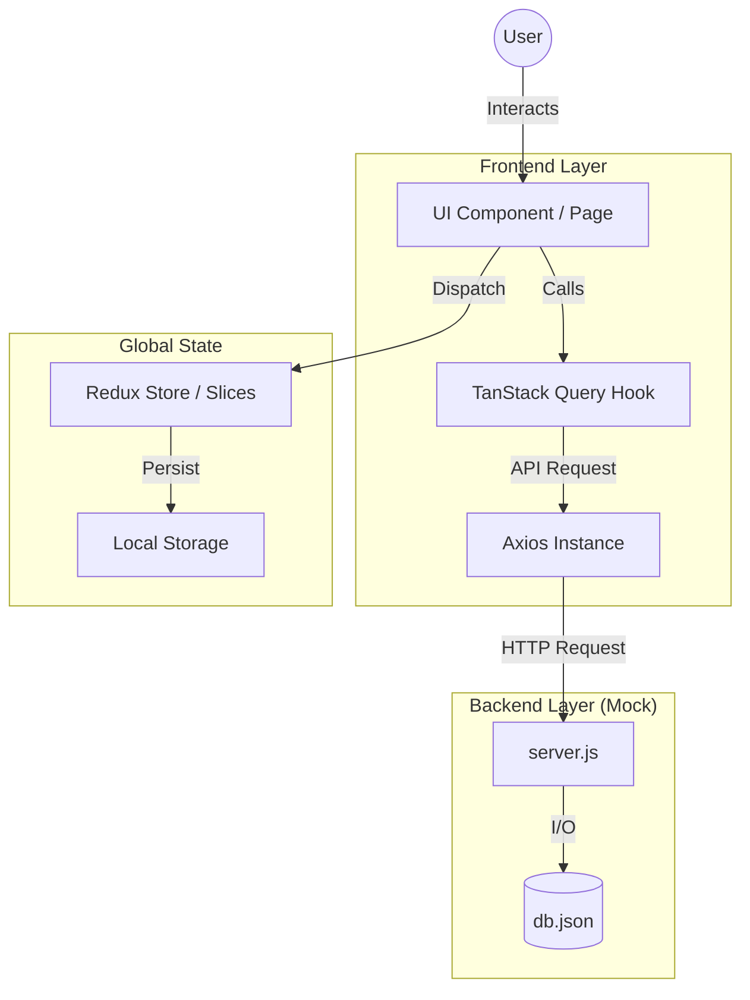

# ShopWave: Standardized Architecture & Execution Map 🌊

This project has been professionalized with a standardized documentation system. Informal comments have been replaced with a structured **Flow ID** sequence (`Axx`) to map the functional execution from start to finish.

---

## 1. 📊 Project Execution Flow (Architecture)

The following diagram illustrates the relationship between the UI, State Management, and the Mock Backend:

---

## 2. 🧩 Documentation Standard: Workflow IDs

Every core file follows a standardized header format documenting its primary functional purpose. The `Axx` identifiers represent the sequence of execution or functional hierarchy within the system.

- **Objective**: To provide a clear, professional map of how data flows through each component.
- **Scope**: Covers both the customer-facing storefront and the administrative control panel.

---

## 3. 🚀 Functional Roadmap (Workflow Map)

### A. Core Application & Customer Flow
- **A2 ([App.jsx](file:///e:/WebDevlopment/React/Project/ecommerce/src/App.jsx)):** Global initialization, cart synchronization, and authentication persistence.
- **A9 ([Home.jsx](file:///e:/WebDevlopment/React/Project/ecommerce/src/pages/Home.jsx)):** Landing page logic, featured collection fetching, and promotional banner management.
- **A12 ([Shop.jsx](file:///e:/WebDevlopment/React/Project/ecommerce/src/pages/Shop.jsx)):** Advanced product filtering pipeline, category sorting, and real-time search indexing.
- **A13 ([ProductDetail.jsx](file:///e:/WebDevlopment/React/Project/ecommerce/src/pages/ProductDetail.jsx)):** Individual product specification rendering and dynamic cart interaction.
- **A14 ([Cart.jsx](file:///e:/WebDevlopment/React/Project/ecommerce/src/pages/Cart.jsx)):** Shopping bag management, quantity adjustment, and coupon eligibility validation.
- **A18 ([Checkout.jsx](file:///e:/WebDevlopment/React/Project/ecommerce/src/pages/Checkout.jsx)):** Shipping credential validation, payment method selection, and order execution.
- **A19 ([OrderSuccess.jsx](file:///e:/WebDevlopment/React/Project/ecommerce/src/pages/OrderSuccess.jsx)):** Post-purchase receipt generation and fulfillment status tracking.
- **A20 ([Profile.jsx](file:///e:/WebDevlopment/React/Project/ecommerce/src/pages/Profile.jsx)):** User account management, order history monitoring, and address aggregation.

### B. Administrative Control Panel
- **A32 ([AdminDashboard.jsx](file:///e:/WebDevlopment/React/Project/ecommerce/src/admin/pages/AdminDashboard.jsx)):** Business analytics visualization and real-time order monitoring.
- **A33 ([AdminProducts.jsx](file:///e:/WebDevlopment/React/Project/ecommerce/src/admin/pages/AdminProducts.jsx)):** Inventory management with full CRUD operations and relational binding.
- **A34 ([AdminCoupons.jsx](file:///e:/WebDevlopment/React/Project/ecommerce/src/admin/pages/AdminCoupons.jsx)):** Promotional token management and user-specific eligibility controls.
- **A35 ([AdminOrders.jsx](file:///e:/WebDevlopment/React/Project/ecommerce/src/admin/pages/AdminOrders.jsx)):** Order lifecycle management with status tracking and expanded customer data.
- **A36 ([AdminCategories.jsx](file:///e:/WebDevlopment/React/Project/ecommerce/src/admin/pages/AdminCategories.jsx)):** Relational hierarchy management for categories and subcategories.
- **A38 ([AdminUsers.jsx](file:///e:/WebDevlopment/React/Project/ecommerce/src/admin/pages/AdminUsers.jsx)):** User account governance, status monitoring, and access control.

---

## 4. 📂 Core Infrastructure

| Module | Responsibility |
| :--- | :--- |
| `server.js` | Mock backend engine providing RESTful endpoints for all entity types. |
| `db.json` | Centralized data store maintaining relational integrity. |
| `src/api/` | Standardized Axios configurations for storefront and administrative layers. |
| `src/features/` | Redux slices governing global authentication and local cart state. |

---

## 💡 Engineering Note:
To understand a feature, navigate to its respective file and locate the `Axx` header. The code is structured to be self-contained, ensuring that data fetching, state logic, and UI rendering are transparent and maintainable.
